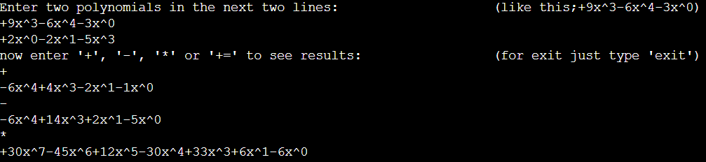

# Polynomials-Integer

This C++ program allows you to add, subtract, multiply, and modify polynomials with integer coefficients. You can add two polynomials together (+), subtract one from the other (-), multiply them (*), and even modify the first polynomial using the results of addition operation (+=).

You can use this format for entering your polynomials. ``+9x^3-6x^4-3x^0``. Note that the order of the terms in the polynomials is not important. After each operation, the polynomial terms will be sorted in descending order of degree.



Check out [Polynomials-Integer](https://github.com/FarnoodID/Polynomials-Integer) for a similar program that operates on polynomials with integer coefficients.

To compile the C++ program, use the following command:
```bash
g++ Polynomials_Integer.cpp -o output.exe
```
To run the program, use the command:
```bash
./output.exe
```

Alternatively, you can run the program online using [onlinegdb](https://onlinegdb.com/), a web-based compiler and debugger for C++ and other programming languages. Simply copy and paste your code into the editor, then click the "Run" button.
